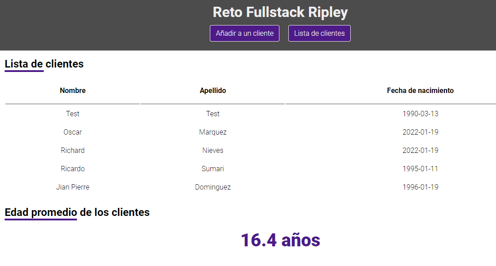
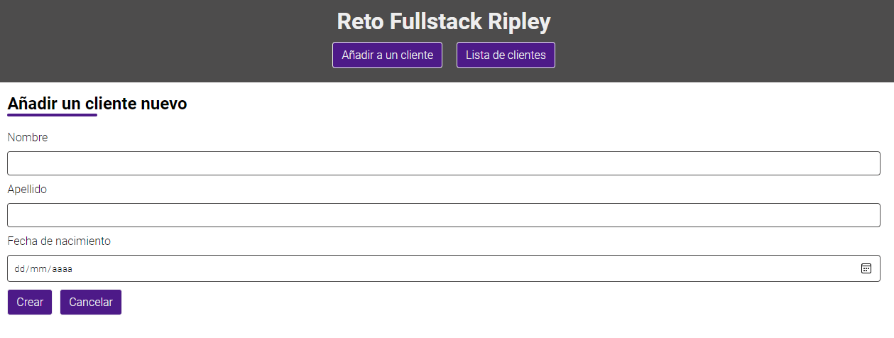

# Reto de Ripley



> Screenshot - List of clients



> Screenshot - Add a new client

---

## Table of Contents

- [Description](#description)
- [How to use?](#how-to-use)
- [References](#references)
- [License](#license)
- [Author](#author)

---

## Description

Responsive web application developed with ReactJS + NodeJS + ExpressJS, which shows a list of clients in addition to being able to create new ones.

### Technologies

- Node.js
- Express
- HTML
- CSS
- JavaScript
- ReactJS
- Styled components
- MySQL

[Go up](#reto-de-ripley)

---

## How to use?

### Prepare and run the backend:

First, after cloning the project locally, install the dependencies to the local in /backend directory. (Note: I use 16.13.1 version in this project.)

```html
$ cd backend
```

```html
$ npm install
```

And start up the server:

```html
$ npm src/index.js
```

Finally, navigate to http://localhost:3001 in your web browser.

### Prepare and run the frontend:

First, navigate into the directory:

```html
$ cd frontend
```

Next, install dependencies using yarn (node version v16.13.1):

```html
yarn install
```

Enter and run the following sentence in your console:

```html
yarn start
```

to enter developer mode.

Finally, open [http://localhost:3000](http://localhost:3000) to see it in your default browser.

---

## References

ReactJS official documentation:

```html
https://reactjs.org/docs/getting-started.html
```

Loader component:

```html
https://icons8.com/cssload/en/horizontal-bars
```

[Go up](#reto-de-ripley)

---

## Comments

- You can filter the table, in addition to sorting in ascending and descending order with respect to various fields.

- Honestly, I managed to finish all the application requirements except one: Filtered by backend. I feel like I lacked time and knowledge about backend.

- The application is responsive.

[Go up](#reto-de-ripley)

---

## License

MIT License

Copyright (c) [2021] [Heraldo Fortuna]

Permission is hereby granted, free of charge, to any person obtaining a copy
of this software and associated documentation files (the "Software"), to deal
in the Software without restriction, including without limitation the rights
to use, copy, modify, merge, publish, distribute, sublicense, and/or sell
copies of the Software, and to permit persons to whom the Software is
furnished to do so, subject to the following conditions:

The above copyright notice and this permission notice shall be included in all
copies or substantial portions of the Software.

THE SOFTWARE IS PROVIDED "AS IS", WITHOUT WARRANTY OF ANY KIND, EXPRESS OR
IMPLIED, INCLUDING BUT NOT LIMITED TO THE WARRANTIES OF MERCHANTABILITY,
FITNESS FOR A PARTICULAR PURPOSE AND NONINFRINGEMENT. IN NO EVENT SHALL THE
AUTHORS OR COPYRIGHT HOLDERS BE LIABLE FOR ANY CLAIM, DAMAGES OR OTHER
LIABILITY, WHETHER IN AN ACTION OF CONTRACT, TORT OR OTHERWISE, ARISING FROM,
OUT OF OR IN CONNECTION WITH THE SOFTWARE OR THE USE OR OTHER DEALINGS IN THE
SOFTWARE.

[Go up](#reto-de-ripley)

---

## Author

- Twitter - [@heraldofortuna](https://twitter.com/heraldofortuna)
- GitHub - [heraldofortuna](https://github.com/heraldofortuna)
- Linkedin - [heraldofortuna](https://www.linkedin.com/in/heraldo-fortuna/)

[Go up](#reto-de-ripley)
